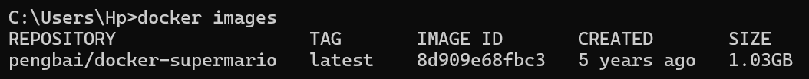

# Docker

---

> Vérifier la version d'installation de docker avec la commande

> Tester les commandes de base dans le terminal :

- docker info

- docker ps
  (aucun container)
  

- docker images
  

- docker run
  (sans arguments, aucun container a run)
  

- docker stop
  (sans arguments, aucun container actif a stop)
  

- docker pull
  pull l'image docker/welcome-to-docker
  

- docker images
  (on peut voir l'image welcome-to-docker)
  

- docker run
  `docker run -it --rm -p 8080:80 docker/welcome-to-docker`
  -it interactive terminal
  --rm delete on closing
  -p redirect ports
  

> Dans l’explorateur internet trouver le moyen d’accéder au container

- docker stop
  

- docker rm
  (le container ayant été run avec --rm, le container est delete immédiatement lors de la commande stop)
  

- docker rmi
  

---

> Donner un exemple de ligne de commande pour ces actions pour supprimer :

- Un conteneur spécifique
  `docker rm <id>`
- Plusieurs conteneurs
  `docker rm <id1> <id2> <id...>`
- Tous les conteneurs arrêtés
  `docker container prune`
- Forcer la suppression d'un conteneur actif
  `docker rm --force <id>`
- Une image spécifique
  `docker rmi <nom>`
- Plusieurs images
  `docker rmi <nom1> <nom2> <nom...>`
- Toutes les images inutilisées
  `docker image prune`
- Toutes les images non utilisées
  `docker image prune -a`

> voir: https://stackoverflow.com/questions/45142528/what-is-a-dangling-image-and-what-is-an-unused-image

- Forcer la suppression d'une image
  `docker rmi --force <nom>`
- Quel erreur est présente dans les commandes données
  ci-dessus, donner la correction
