# Docker job03

---

- Ouvrir docker-desktop
  Placez vous sur le menu à gauche dans “images”
  Trouver le terminal dans Docker Desktop
  Chercher l’image docker cité ci-dessus par une commande dans ve dernier

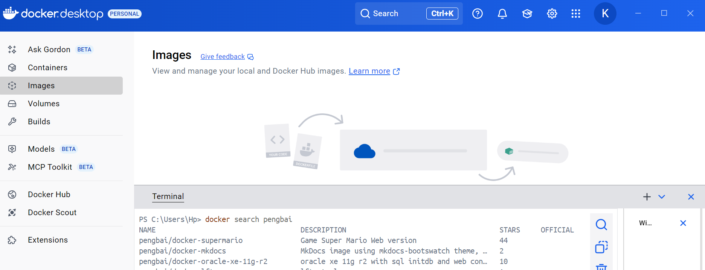

- Récupérer l’image Docker dans “Docker-Desktop”
  Observer quand vous avez validé votre commande ce qui c’est passé dans votre fenêtre au dessus

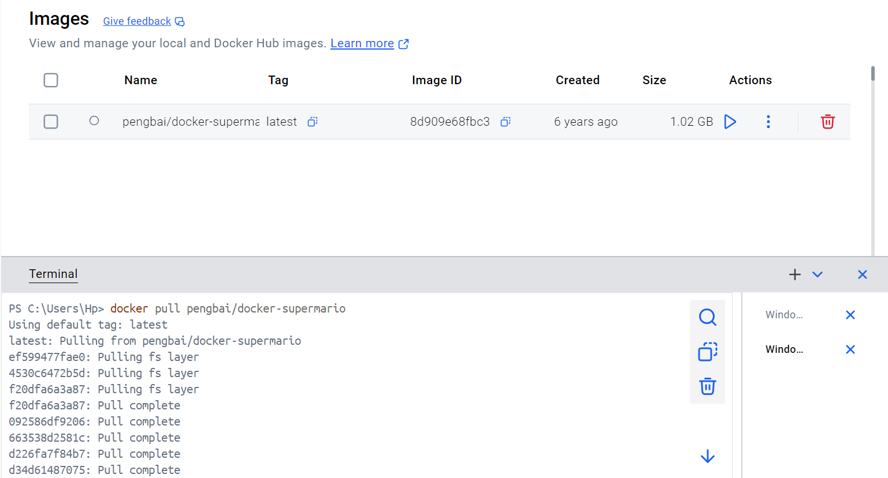

- PLacez vous sur le menu gauche sur container
  Lancer un container avec cette image et assignez lui le port 8600 en considérant que l’image est configuré sur le port 8080 et en conservant l'accès à l’invite de commande
  observer quand vous avez validé votre commande ce qui c’est passé dans votre fenêtre au dessus

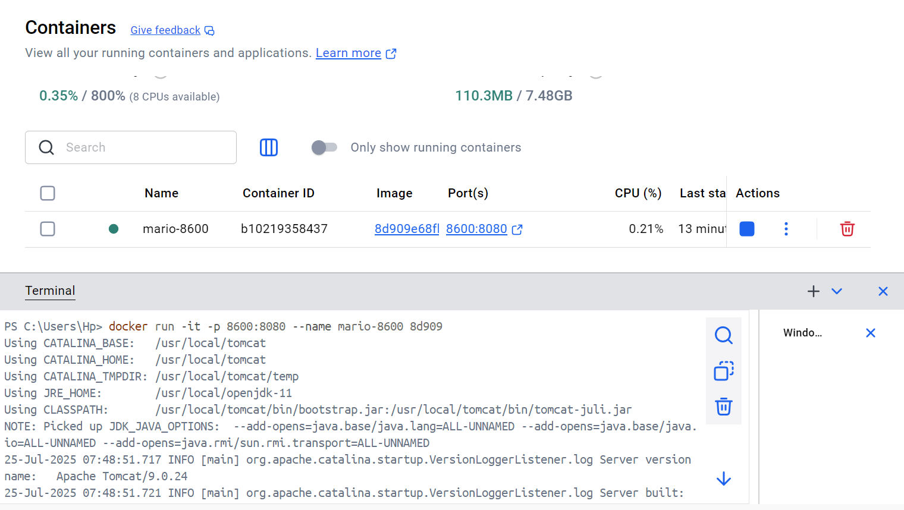

- Trouvé les deux méthodes avec des ports différents de
  le faire (invite de commande et ???)
  Lancer une autre image de super mario sur un port différent

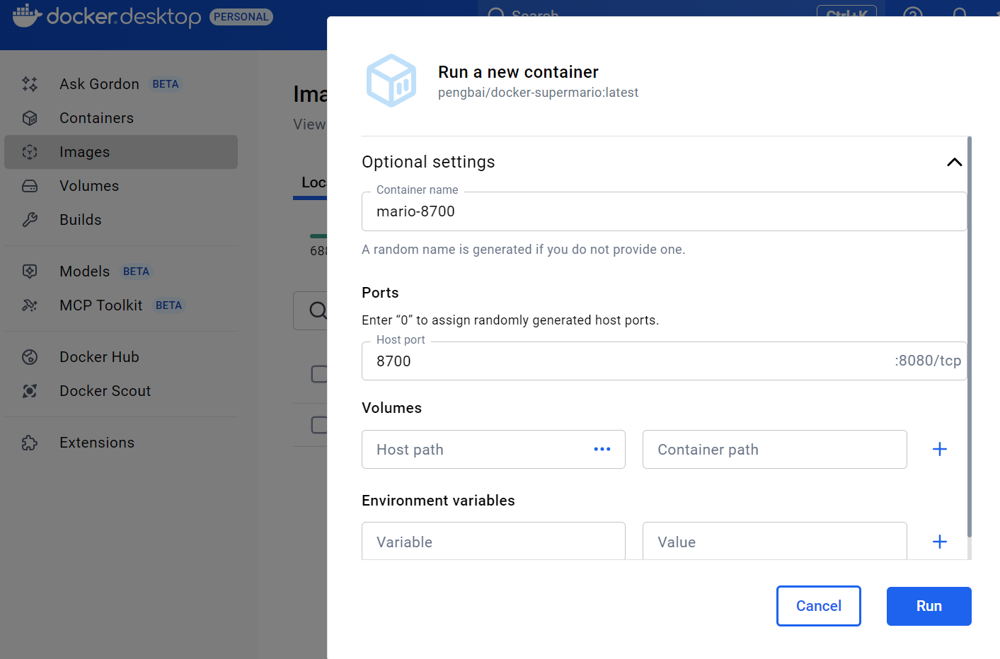

- Ouvrir votre explorateur et trouver le moyen d’accéder au container construit
  Accéder et jouer un peu dans votre explorateur internet (faites des captures du jeux en cours “3 au moins”)

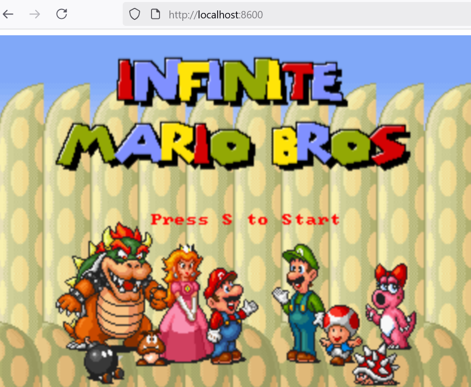

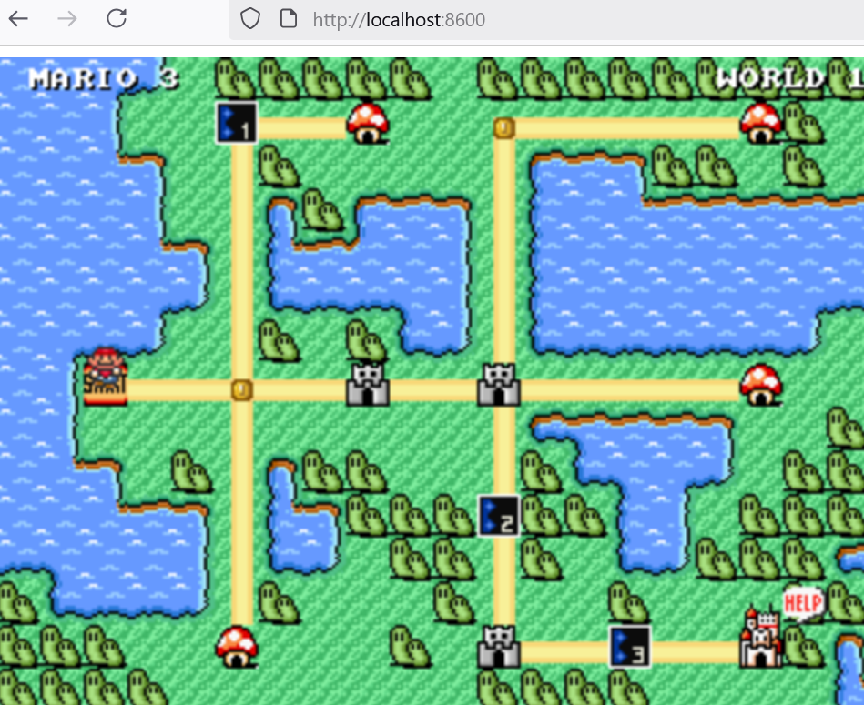

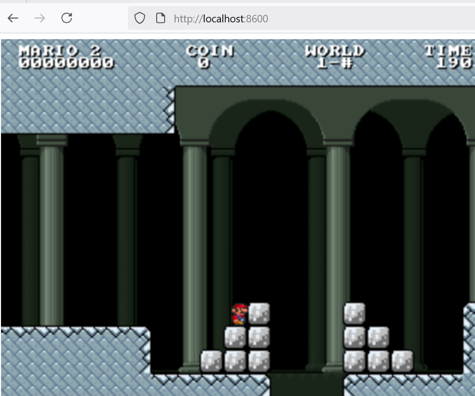

- retourner dans le terminal de docker desktop
  Arrêter votre container par son ID (2 manière de trouver l’ID)
  observer quand vous avez validé votre commande ce qui c’est passé dans votre fenêtre au dessus

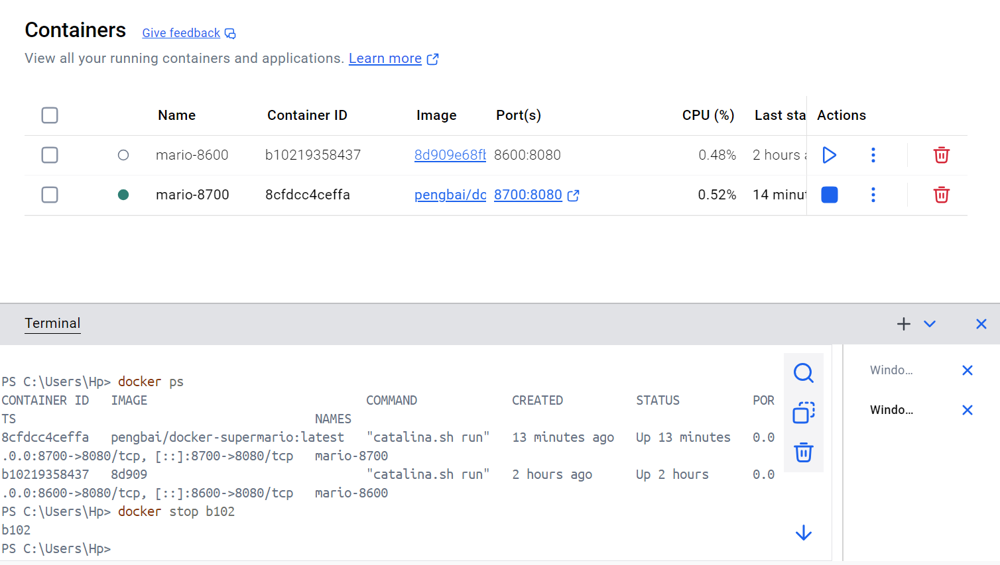

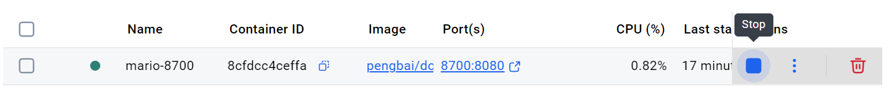

- Supprimer le container (2 manières)
  observer quand vous avez validé votre commande ce qui c’est passé dans votre fenêtre au dessus

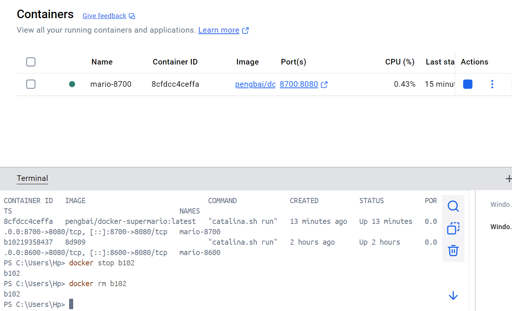

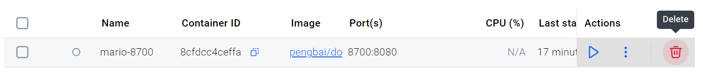

- supprimer l’image docker de super mario (2 manières)
  observer quand vous avez validé votre commande ce qui c’est passé dans votre fenêtre au dessus

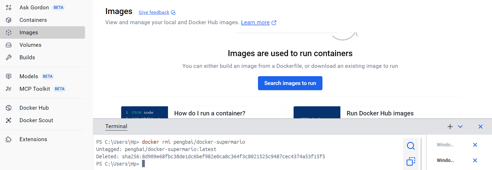

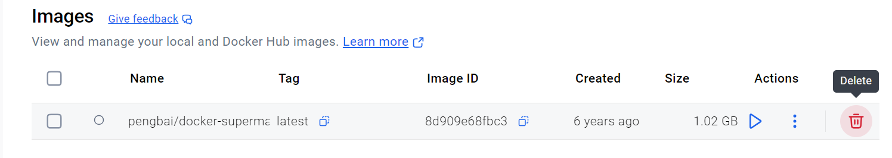
